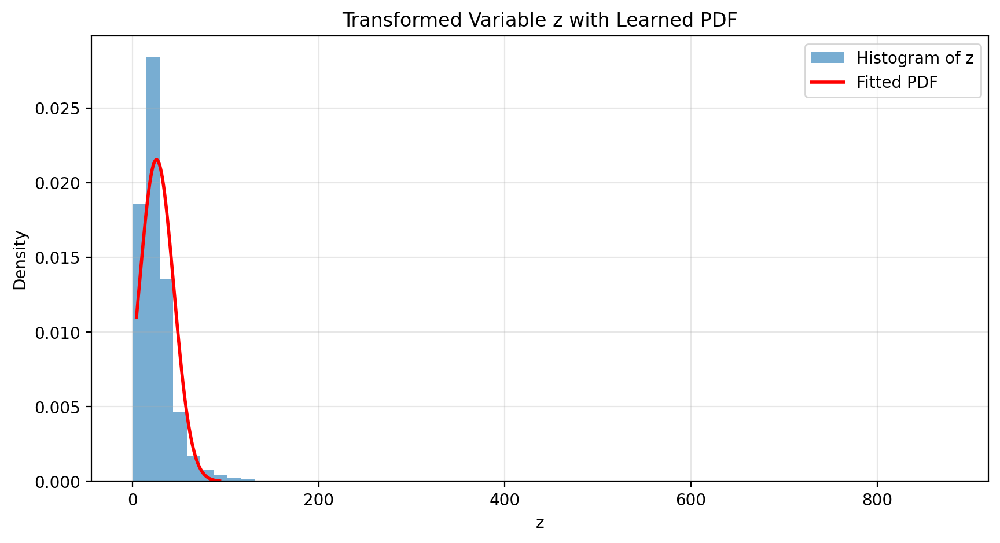

# 📘 Learn Probability Density Functions using Roll-Number-Parameterized Non-Linear Model

## 📌 Objective
The objective of this assignment is to learn the parameters of a probability density function (PDF) using a roll-number-parameterized non-linear transformation applied to real-world air quality data. The parameters of the PDF are estimated using Maximum Likelihood Estimation (MLE).

---

## 📊 Dataset Description
- **Dataset:** India Air Quality Data (Kaggle)
- **File Used:** `data.csv`
- **Feature Selected:** `NO₂` (Nitrogen Dioxide concentration)

Only the NO₂ feature is used for this assignment.

---

## 🧹 Data Preprocessing
The following preprocessing steps were applied:
- Conversion of values to numeric format
- Removal of missing (NaN) values
- Removal of invalid (negative) values

After preprocessing, only valid NO₂ samples were retained.
- **Total samples used:** 419,509

---

## 🔢 Roll Number Based Transformation
- **Name:** Sarishti  
- **Roll Number:** 102317212  

The non-linear transformation applied to input feature \( x \) is:

\[
z = x + a_r \sin(b_r x)
\]

Where:
\[
a_r = 0.05 \times (r \bmod 7), \quad b_r = 0.3 \times (r \bmod 5 + 1)
\]

### Computed Values

| Parameter | Value |
|---------|-------|
| a_r | 0.20 |
| b_r | 0.90 |

---

## 📈 Probability Density Function
The PDF to be learned is defined as:

\[
\hat{p}(z) = c \cdot e^{-\lambda (z - \mu)^2}
\]

This corresponds to a Gaussian-type distribution where \( \mu \), \( \lambda \), and \( c \) are the parameters to be learned.

---

## 🧪 Methodology
1. Extracted and cleaned the NO₂ feature from the dataset.
2. Applied roll-number-based non-linear transformation to obtain variable \( z \).
3. Assumed \( z \) follows a Gaussian-type PDF.
4. Estimated parameters using closed-form Maximum Likelihood Estimation (MLE).
5. Validated the learned PDF using histogram and fitted curve.

---

## 📋 Result Table

| Parameter | Description | Value |
|---------|------------|-------|
| μ | Mean of transformed variable z | 25.8041 |
| λ | Shape parameter of the PDF | 0.001459 |
| c | Normalization constant | 0.021553 |

---

## 📊 Result Graph
- Histogram represents the empirical distribution of transformed variable \( z \)
- Smooth curve represents the learned PDF using MLE
- Close alignment indicates a good fit

  

---

## 📤 Submission Values
The following values were submitted:
- **μ = 25.8041**
- **λ = 0.001459**
- **c = 0.021553**

---

## 🏁 Conclusion
This assignment successfully demonstrates PDF parameter estimation using a roll-number-parameterized non-linear model on real-world air quality data. The learned distribution closely matches the empirical data, validating the modeling approach.
